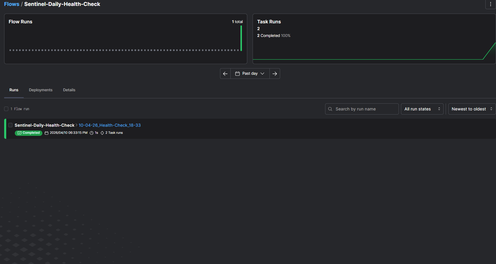
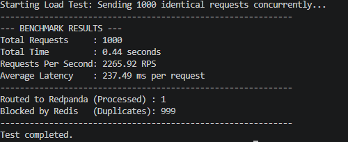

# Real-Time AI Fraud Detection
Sentinel is an enterprise-grade, real-time fraud detection system. It simulates high-throughput financial transactions via streaming (Redpanda/Kafka) and evaluates them in milliseconds using an optimized ONNX inference engine.

---

### If You're a Data Scientist or ML Engineer: High-Speed Inference & Serialization
The foundation of this project is built on strict data science principles, avoiding common pitfalls of highly imbalanced datasets (Fraud ratio: 0.17%).

If you want to explore the model engineering phase, navigate to the `experiments/` directory.

### 1. Data Processing
* Applies `RobustScaler` to numerical columns to handle extreme outliers without squashing the transaction variance.
* Strips unnecessary structures to prepare for raw array inputs.

**Visual Evidence of Class Imbalance:**


### 2. Model Benchmarking
We don't guess; we benchmark. The evaluation strictly avoids "Accuracy" and focuses on **PR-AUC** and **Inference Latency**.

| Model | PR-AUC | Recall | Precision | F1-Score | Inference Time |
| :--- | :--- | :--- | :--- | :--- | :--- |
| **XGBoost** | **0.8752** | **0.8469** | **0.8925** | **0.8691** | **0.0011 ms/row** |
| LightGBM | 0.8724 | 0.8571 | 0.8485 | 0.8528 | 0.0023 ms/row |
| Random Forest | 0.8501 | 0.7449 | 0.9605 | 0.8391 | 0.0025 ms/row |

**Visual Evidence of Benchmark Arena:**


*XGBoost was selected as the champion model due to its superior PR-AUC and sub-millisecond inference speed.*

### 3. Production Export
The champion XGBoost model is trained on the full dataset with calculated `scale_pos_weight` and exported to the **ONNX** format.
* **Final Model Size:** 176.47 KB (Optimized for microservices and RAM efficiency).

## If You're a Data Engineer: Event-Driven Architecture & Stream Processing
The architecture decouples data ingestion from inference using **Redpanda** (Kafka-compatible message broker). This ensures high throughput, fault tolerance, and true real-time streaming capabilities.

### 1. The Highway
We deploy Redpanda and Redpanda Console via Docker to handle message brokering. The infrastructure is configured with dedicated internal and external advertised listeners to support cross-container and host communications.

### 2. The Ingestor
A custom Python producer reads the raw historical transactions and streams them into the `transactions` topic at a controlled rate (e.g., 5-10 messages/second).
* **Crucial Detail:** The `Class` (Fraud/Normal) label is deliberately stripped before ingestion to simulate a true production environment where the model must make blind predictions.

**Visual Evidence of Real-Time Streaming:**


### 3. Enterprise Logging
All services use a standardized, timestamped Python `logging` configuration instead of raw print statements, ensuring observability across the pipeline.

### If You're a DevOps Engineer: Containerization & Orchestration

The entire infrastructure is dockerized with production-grade DevSecOps practices to ensure reproducibility and security across environments.

**Architecture Highlights:**
* **Multi-Stage Builds:** Reduced image sizes by compiling C-dependencies (like librdkafka) in a builder stage and extracting only the necessary artifacts to the runtime stage.
* **Layer Caching:** Separated dependency files for the frontend and backend, leveraging the `uv` package manager for ultra-fast, cached dependency resolution.
* **Security First:** Containers run as a non-root user (sentinel) with explicit permission boundaries and home directory allocations to prevent privilege escalation.
* **Seamless Orchestration:** The `docker-compose.yml` orchestrates the API Gateway, Streamlit UI, Redis (Idempotency Lock), and Redpanda (Event Stream) within an isolated Docker network.

**Visual Evidence: Real-Time UI**


### If You're a QA Engineer or Tech Lead: Dual-Layered Testing Strategy

To balance execution speed and real-world reliability, the test suite is strictly bifurcated into two distinct layers.

**Testing Architecture Highlights:**
* **Isolated Unit Tests (`test_api_logic.py`):** External dependencies (Redis, Redpanda) are completely stubbed using `AsyncMock`. This guarantees instantaneous execution and validates the core FastAPI routing, Pydantic schema validation, and internal logic without any infrastructure overhead.
* **Live Integration Tests (`test_api.py`):** Infrastructure-dependent. These tests interact directly with the active Docker containers to validate the actual network I/O, the Redis idempotency lock mechanics, and the Redpanda event ingestion.
* **Coverage & Reliability:** The suite currently maintains an **81% code coverage**, ensuring that critical paths and architectural boundaries are fully verified.

**Test Execution & Coverage Evidence:**


## Kubernetes Migration Status

The project has been successfully migrated to a localized Kubernetes (K8s) architecture. The entire data pipeline and microservices stack are fully operational within the cluster.

**Successfully Deployed Services:**
* **FastAPI Gateway** (`api-deployment`, `api-service`) - Handles incoming traffic and model inference.
* **Streamlit Dashboard** (`ui-deployment`, `ui-service`) - Interactive user interface.
* **Redis Cache** (`redis-deployment`, `redis-service`) - High-speed caching layer.
* **Redpanda (Kafka)** (`redpanda-deployment`, `redpanda-service`) - Real-time event streaming engine running in dev-container mode.

**Next Steps & Roadmap:**
* Package the current K8s manifests into **Helm Charts** for dynamic configuration.
* Integrate **ArgoCD** for automated GitOps deployments and continuous delivery.

## System Architecture & API Gateway

This project implements a decoupled, event-driven microservices architecture:

1.  **FastAPI Gateway (Entry Point):** Acts as the primary ingress for external systems (e.g., POS terminals, Web Apps). It utilizes `Pydantic` for strict data validation and asynchronously publishes valid transactions to the message broker, returning a `202 Accepted` status within milliseconds.
2.  **Redpanda (Message Broker):** A Kafka-compatible streaming platform that handles high-throughput data ingestion, decoupling the API from the inference engine and providing built-in backpressure management.
3.  **Inference Engine (Kafka Consumer):** A standalone Python service that continuously polls the message broker. It applies real-time feature transformations (using decoupled `RobustScaler` artifacts) and feeds the normalized data into the 176 KB ONNX XGBoost model for sub-millisecond fraud detection.

## Pipeline Orchestration & Monitoring

To ensure the reliability of the machine learning lifecycle and data ingestion pipelines, **Prefect** is integrated as the primary orchestration engine.

Instead of relying on fragmented scripts, the system utilizes Prefect DAGs (Directed Acyclic Graphs) to manage task dependencies, automatic retries, and failure alerts.

**Key Orchestration Features:**
* **Dynamic Run Naming:** Automated timestamp-based tags (e.g., `10-04-26_Health-Check_18-33`) for precise tracing.
* **Resilience:** Built-in task retries and delay mechanisms to handle transient network or service failures.
* **Observability:** Full integration with the Prefect UI for real-time monitoring of task states and pipeline health.



### API Usage (Swagger UI)

The API is fully documented and testable via the automatically generated Swagger UI.

**Endpoint:** `POST /api/v1/transactions`

**Payload Example:**
```json
{
  "Time": 406.0,
  "V1": -2.312226542,
  "V2": 1.951992011,
  "...",
  "Amount": 0.0
}
```
*Note: The system handles raw Time and Amount values. Preprocessing and scaling are applied on the fly by the inference engine to prevent training-serving skew.*

### Idempotency & Performance Benchmarking

In high-throughput financial systems, duplicate transactions (e.g., a user double-clicking "Pay") can lead to critical data corruption. To prevent this, an **Atomic Redis Lock** is implemented at the API Gateway level.

We conducted an asynchronous load test simulating a severe race condition: sending **1,000 identical transactions concurrently** to the API.

**Visual Evidence of Redis Test:**


The system utilizes Redis `SETNX` (Set if Not eXists) atomic operations to mitigate "Check-Then-Act" vulnerabilities. This ensures sub-millisecond duplicate detection without adding latency to the main Kafka stream or the ONNX inference engine.
