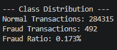
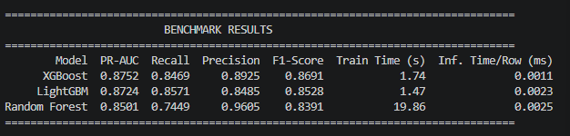
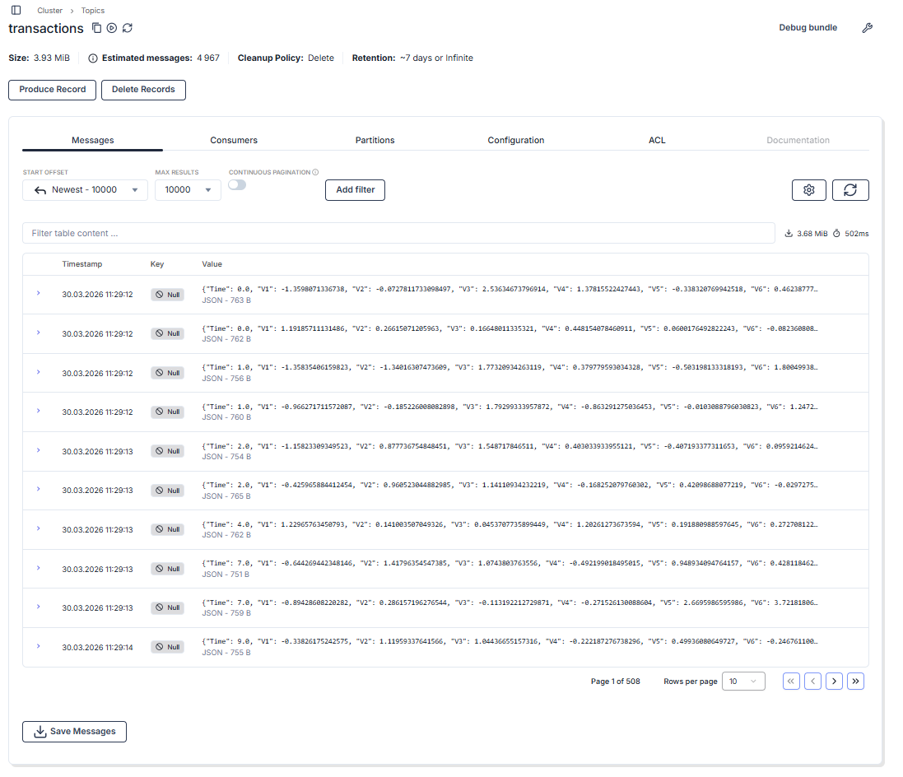

# Real-Time AI Fraud Detection
Sentinel is an enterprise-grade, real-time fraud detection system. It simulates high-throughput financial transactions via streaming (Redpanda/Kafka) and evaluates them in milliseconds using an optimized ONNX inference engine.

---

## If You're a Data Scientist
The foundation of this project is built on strict data science principles, avoiding common pitfalls of highly imbalanced datasets (Fraud ratio: 0.17%).

If you want to explore the model engineering phase, navigate to the `experiments/` directory.

### 1. Data Processing
* Applies `RobustScaler` to numerical columns to handle extreme outliers without squashing the transaction variance.
* Strips unnecessary structures to prepare for raw array inputs.

**Visual Evidence of Class Imbalance:**

### 2. Model Benchmarking
We don't guess; we benchmark. The evaluation strictly avoids "Accuracy" and focuses on **PR-AUC** and **Inference Latency**.

| Model | PR-AUC | Recall | Precision | F1-Score | Inference Time |
| :--- | :--- | :--- | :--- | :--- | :--- |
| **XGBoost** | **0.8752** | **0.8469** | **0.8925** | **0.8691** | **0.0011 ms/row** |
| LightGBM | 0.8724 | 0.8571 | 0.8485 | 0.8528 | 0.0023 ms/row |
| Random Forest | 0.8501 | 0.7449 | 0.9605 | 0.8391 | 0.0025 ms/row |

**Visual Evidence of Benchmark Arena:**

*XGBoost was selected as the champion model due to its superior PR-AUC and sub-millisecond inference speed.*

### 3. Production Export
The champion XGBoost model is trained on the full dataset with calculated `scale_pos_weight` and exported to the **ONNX** format.
* **Final Model Size:** 176.47 KB (Optimized for microservices and RAM efficiency).

## If You're a Data Engineer 
The architecture decouples data ingestion from inference using **Redpanda** (Kafka-compatible message broker). This ensures high throughput, fault tolerance, and true real-time streaming capabilities.

### 1. The Highway 
We deploy Redpanda and Redpanda Console via Docker to handle message brokering. The infrastructure is configured with dedicated internal and external advertised listeners to support cross-container and host communications.

### 2. The Ingestor
A custom Python producer reads the raw historical transactions and streams them into the `transactions` topic at a controlled rate (e.g., 5-10 messages/second).
* **Crucial Detail:** The `Class` (Fraud/Normal) label is deliberately stripped before ingestion to simulate a true production environment where the model must make blind predictions.

**Visual Evidence of Real-Time Streaming:**

### 3. Enterprise Logging
All services use a standardized, timestamped Python `logging` configuration instead of raw print statements, ensuring observability across the pipeline.