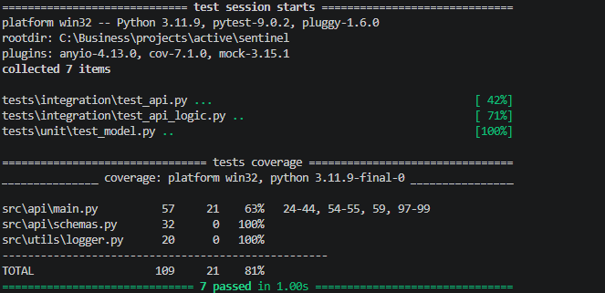

# Sentinel: Real-Time AI Fraud Detection

*Enterprise-grade, event-driven anomaly detection pipeline with sub-millisecond ONNX inference.*

 

---
**Sentinel** is an enterprise-grade, real-time fraud detection system. It simulates high-throughput financial transactions via streaming (Redpanda/Kafka) and evaluates them in milliseconds using an optimized ONNX inference engine.

## Data Science & Model Engineering
**Focus:** High-Speed Inference, Serialization, and Skew Prevention

The foundation of this pipeline is built on strict machine learning principles designed to handle highly imbalanced financial datasets (Fraud ratio: `0.17%`). The end-to-end model engineering lifecycle is isolated within the `experiments/` directory.

### 1. Data Processing & Feature Engineering
Handling an extreme class imbalance requires preprocessing techniques that preserve the anomaly signals without distorting the underlying distribution.

* **Outlier-Aware Scaling:** Standard scaling mechanisms (mean/variance) are susceptible to distortion by extreme anomalies. We implement `RobustScaler`, which uses the Interquartile Range (IQR) to center and scale numerical features. This ensures that massive fraudulent transactions do not skew the baseline distribution while remaining detectable as distinct outliers.
* **Artifact Decoupling for Streaming:** To guarantee zero training-serving skew, the fitted scaler state is serialized (`scaler.pkl`) independently from the model. This exact artifact is loaded into the memory of the Kafka Consumer, ensuring real-time payloads are transformed using the exact same mathematical boundaries as the training phase.
* **Payload Optimization:** The pipeline strips unessential categorical metadata and flattens the incoming JSON structures into raw, homogeneous Numpy arrays. This minimizes serialization overhead and prepares the data for strict array-based ONNX inference.

### 2. Model Benchmarking
We don't guess; we benchmark. The evaluation strictly avoids "Accuracy" and focuses on **PR-AUC** and **Inference Latency**.

| Model | PR-AUC | Recall | Precision | F1-Score | Train Time (s) | Real-Time Latency |
| :--- | :--- | :--- | :--- | :--- | :--- | :--- |
| **XGBoost** | **0.8800** | **0.8817** | **0.8586** | **0.8586** | **1.83** | **0.7210 ms/row** |
| LightGBM | 0.8710 | 0.8571 | 0.8400 | 0.8485 | 1.42 | 2.9719 ms/row |
| Random Forest | 0.8542 | 0.7449 | 0.9605 | 0.8391 | 19.06 | 22.2659 ms/row |

> *XGBoost was selected as the champion model due to its superior PR-AUC and sub-millisecond inference speed.*

### 3. Production Export
The champion XGBoost model is trained on the full dataset with calculated `scale_pos_weight` and exported to the **ONNX** format.
* **Final Model Size:** `160.24 KB` (Optimized for microservices and RAM efficiency).

## Data Engineering
**Focus:** Event-Driven Architecture & Stream Processing

The architecture decouples data ingestion from inference using **Redpanda** (Kafka-compatible message broker). This ensures high throughput, fault tolerance, and true real-time streaming capabilities.

### 1. The Highway
We deploy Redpanda and Redpanda Console via Docker to handle message brokering. The infrastructure is configured with dedicated internal and external advertised listeners to support cross-container and host communications.

### 2. The Ingestor
A custom Python producer reads the raw historical transactions and streams them into the `transactions` topic at a controlled rate (e.g., 5-10 messages/second).
* **Crucial Detail:** The `Class` (Fraud/Normal) label is deliberately stripped before ingestion to simulate a true production environment where the model must make blind predictions.

**Visual Evidence of Real-Time Streaming:** 

### 3. Enterprise Logging
All services use a standardized, timestamped Python `logging` configuration instead of raw print statements, ensuring observability across the pipeline.

## If You're a DevOps Engineer
**Focus:** Containerization & Orchestration

The entire infrastructure is dockerized with production-grade DevSecOps practices to ensure reproducibility and security across environments.

**Architecture Highlights:**
* **Multi-Stage Builds:** Reduced image sizes by compiling C-dependencies (like `librdkafka`) in a builder stage and extracting only the necessary artifacts to the runtime stage.
* **Layer Caching:** Separated dependency files for the frontend and backend, leveraging the `uv` package manager for ultra-fast, cached dependency resolution.
* **Security First:** Containers run as a non-root user (`sentinel`) with explicit permission boundaries and home directory allocations to prevent privilege escalation.
* **Seamless Orchestration:** The `docker-compose.yml` orchestrates the API Gateway, Streamlit UI, Redis (Idempotency Lock), and Redpanda (Event Stream) within an isolated Docker network.

**Visual Evidence: Real-Time UI** 

## If You're a QA Engineer or Tech Lead
**Focus:** Dual-Layered Testing Strategy

To balance execution speed and real-world reliability, the test suite is strictly bifurcated into two distinct layers.

**Testing Architecture Highlights:**
* **Isolated Unit Tests (`test_api_logic.py`):** External dependencies (Redis, Redpanda) are completely stubbed using `AsyncMock`. This guarantees instantaneous execution and validates the core FastAPI routing, Pydantic schema validation, and internal logic without any infrastructure overhead.
* **Live Integration Tests (`test_api.py`):** Infrastructure-dependent. These tests interact directly with the active Docker containers to validate the actual network I/O, the Redis idempotency lock mechanics, and the Redpanda event ingestion.
* **Coverage & Reliability:** The suite currently maintains an **81% code coverage**, ensuring that critical paths and architectural boundaries are fully verified.

**Test Execution & Coverage Evidence:** 
