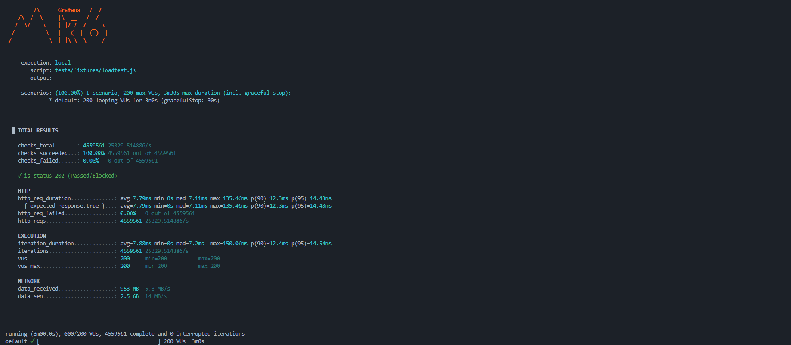
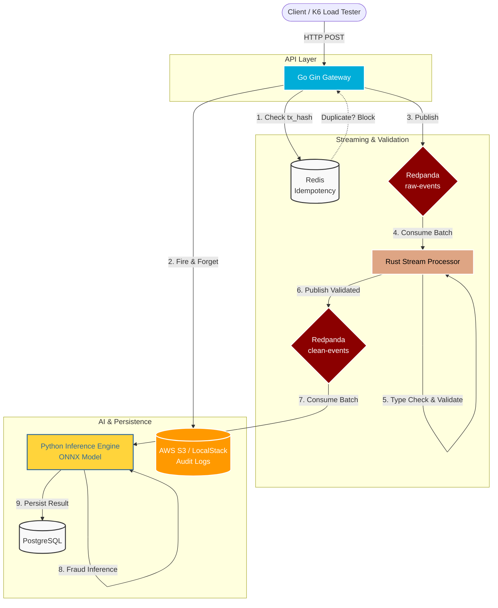

# Sentinel: Real-Time AI Fraud Detection

*Enterprise-grade, event-driven anomaly detection pipeline with sub-millisecond ONNX inference.*

---

**Sentinel** is an enterprise-grade, real-time fraud detection system. It simulates high-throughput financial transactions via streaming (Redpanda/Kafka) and evaluates them in milliseconds using an optimized ONNX inference engine.

*Peak Performance Benchmark: Sustaining 25,300+ RPS with 7.79ms average latency over 4.5 million requests.*

*Note: Note: Peak 25,300+ RPS was achieved under optimal hardware conditions. Standard local Docker Desktop deployments typically yield ~18,000+ RPS due to local CPU and network bridge constraints.*

```mermaid
graph TD
    %% Styling
    classDef go fill:#00ADD8,stroke:#fff,stroke-width:2px,color:#fff;
    classDef rust fill:#DEA584,stroke:#fff,stroke-width:2px,color:#000;
    classDef python fill:#FFD43B,stroke:#306998,stroke-width:2px,color:#306998;
    classDef infra fill:#f9f9f9,stroke:#333,stroke-width:2px;
    classDef storage fill:#ff9900,stroke:#fff,stroke-width:2px,color:#fff;
    classDef broker fill:#8B0000,stroke:#fff,stroke-width:2px,color:#fff;

    %% Nodes
    Client([Client / K6 Load Tester])

    subgraph API Layer
        Gateway[Go Gin Gateway]:::go
    end

    subgraph Streaming & Validation
        Redis[(Redis<br>Idempotency)]:::infra
        Broker1{Redpanda<br>raw-events}:::broker
        Validator[Rust Stream Processor]:::rust
        Broker2{Redpanda<br>clean-events}:::broker
    end

    subgraph AI & Persistence
        Consumer[Python Inference Engine<br>ONNX Model]:::python
        S3[(AWS S3 / LocalStack<br>Audit Logs)]:::storage
        DB[(PostgreSQL)]:::infra
    end

    %% Edges (Flow)
    Client -->|HTTP POST| Gateway
    Gateway -->|1. Check tx_hash| Redis
    Redis -.->|Duplicate? Block| Gateway
    Gateway -->|2. Fire & Forget| S3
    Gateway -->|3. Publish| Broker1
    Broker1 -->|4. Consume Batch| Validator
    Validator -->|5. Type Check & Validate| Validator
    Validator -->|6. Publish Validated| Broker2
    Broker2 -->|7. Consume Batch| Consumer
    Consumer -->|8. Fraud Inference| Consumer
    Consumer -->|9. Persist Result| DB
```

## Quick Start

### Prerequisites
- [Task](https://taskfile.dev/installation/) (`brew install go-task` / `choco install go-task`)
- Docker & Docker Compose
- [uv](https://github.com/astral-sh/uv)

### Setup & Run

    # 1. Clone repository
    git clone https://github.com/enesgulerdev/sentinel.git
    cd sentinel

    # 2. Configure environment (Requires Google Drive File ID for gdown)
    cp .env.example .env

    # 3. Install dependencies via uv
    task env:install

    # 4. Execute ML Pipeline (Fetch dataset, preprocess, train baseline)
    task ml:pipeline

    # 5. Start microservices (API Gateway, Redpanda, etc.)
    task docker:on

### Container Management

    task docker:on    # Start all services
    task docker:down  # Stop gracefully (keeps images intact)
    task docker:off   # Full wipe (removes containers, networks, volumes, images)

## Local Services

| Service | Local URL |
| :--- | :--- |
| **API Gateway** | `http://localhost:8000` |
| **Redpanda** | `http://localhost:8080` |

## Architecture & Deep Dives

Explore the sub-modules for advanced deployment, scaling, and observability patterns:

| Module / Component | Description |
| :--- | :--- |
| **[Testing Suite](tests/README.md)** | Unit, integration, and mock fixtures. |
| **[Helm Workloads](infrastructure/helm/README.md)** | Autonomous local provisioning for stateful dependencies and isolated ML workloads. |
| **[GitOps & CD](infrastructure/argocd/README.md)** | Zero-touch deployment architecture using ArgoCD and Jenkins for deterministic state synchronization. |
| **[AWS FinOps Simulation](infrastructure/terraform/aws-finops-mock/README.md)** | Infracost model demonstrating system scale to **25,300+ RPS** with an **85% cost reduction** under enterprise conditions. |
| **[Policy & Governance](policy/README.md)** | Enterprise Policy-as-Code standards enforcing infrastructure, container, and Kubernetes security via OPA/Rego. |
| **[AI Release Agent](agent/release/README.md)** | Autonomous, AI-driven Python agent for dynamic Semantic Versioning and automated release notes generation via Gemini. |
| **[AI Doc Agent](agent/doc/README.md)** | Autonomous, AI-driven Engineering Council that analyzes git diffs to generate weekly persona-based architectural reviews. |
