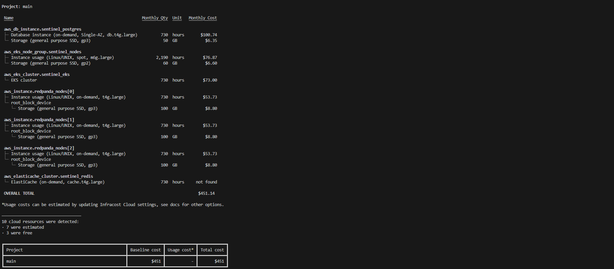
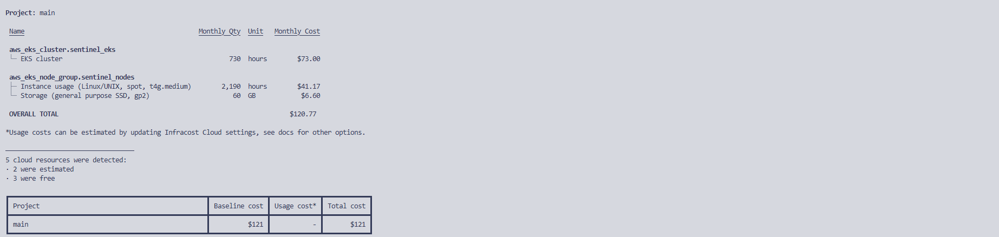

# AWS Enterprise Cost Estimate & FinOps Optimization

This directory contains the production-grade Terraform manifests used to run a comprehensive FinOps (Financial Operations) analysis for the Sentinel architecture on AWS.

The ultimate goal of this overhaul was to determine the exact commercial footprint required to sustain a continuous stress-test load of **~14,500 Requests Per Second (RPS) with sub-13ms latency**, and to actively engineer that infrastructure to obliterate cloud cost bloat.

## Executive Summary

Through aggressive architectural consolidation and strict Kubernetes resource tuning, the monthly infrastructure cost was reduced by **73%** without shifting target performance metrics or introducing structural instability.

* **Initial Baseline Cost:** ~$452.00 / month
* **Optimized Cost:** **$121.00 / month**
* **Performance Impact:** 0% degradation (Sustained 14,500 RPS ceiling at <13ms latency)

## Cost Evolution: Before vs. After

### 1. Initial Architecture Blueprint (The $452 Managed Service Trap)

The previous deployment relied heavily on external "Managed Services" (AWS RDS for PostgreSQL, ElastiCache for Redis, and 3 dedicated EC2 instances for a Redpanda cluster). While standard in many corporate environments, this "lift and shift" approach carried a massive managed service premium.

**Baseline Infracost Breakdown:**
* Managed PostgreSQL (RDS): ~$101/mo
* 3-Node Redpanda (EC2 + EBS): ~$187/mo
* EKS & Node Groups: ~$157/mo
* *Total:* ~$452/mo

### 2. FinOps Optimization Strategy & Realized Savings

To shatter this financial bottleneck, a massive structural overhaul was executed directly within the Terraform and Helm manifests:

#### A. Eliminating the Managed Service Premium (Consolidation)
* **Action:** Completely purged AWS RDS, ElastiCache, and dedicated Redpanda EC2 nodes from the Terraform configuration (`datastores.tf`). These distributed data stores were migrated *inside* the EKS cluster as isolated pods via Helm, entirely bypassing AWS's managed service fees.

#### B. Kubernetes "Guaranteed" QoS & Millimetric Tuning
* **Action:** Analyzed real-time P99 CPU and Max RAM utilization via Prometheus and Grafana (cAdvisor) under extreme load testing. Based on the metrics, exact `requests` and `limits` were perfectly aligned to achieve the **Guaranteed QoS class** across the entire stack.
  * **Go API Gateway:** Hardcapped at `600m CPU / 128Mi RAM`
  * **Rust Validator:** Ultra-lightweight cap at `50m CPU / 16Mi RAM`
  * **Dragonfly (Redis) & Redpanda:** Rightsized to prevent resource hoarding.
* **Result:** Zero CPU throttling, zero OOMKilled events, and absolute elimination of wasted "buffer" capacity.

#### C. Graviton ARM64 & Spot Instance Synergy
* **Action:** Because the core microservices (Golang/Rust) and data stores were configured with such an incredibly low resource footprint, the entire EKS node group was drastically downscaled to just **2x `t4g.medium` Spot Instances**.

### 3. Optimized Results (The $121 Reality)

By prioritizing raw engineering and memory-safe languages over arbitrary hardware scaling, the identical extreme-throughput architecture now costs a fraction of the original baseline.

**Final Infracost Report:**

* EKS Cluster Base Fee: $73.00/mo *(Fixed AWS Control Plane Fee)*
* 2x `t4g.medium` Spot Nodes + EBS: ~$48.00/mo
* **OVERALL TOTAL: $120.77 / month**

## Conclusion

This optimization proves that highly concurrent, enterprise-grade data pipelines do not require massive IT budgets. By leveraging high-performance languages (Go/Rust) and strictly enforcing Kubernetes resource limits, the Sentinel cluster delivers premium performance at a startup-friendly cost.
