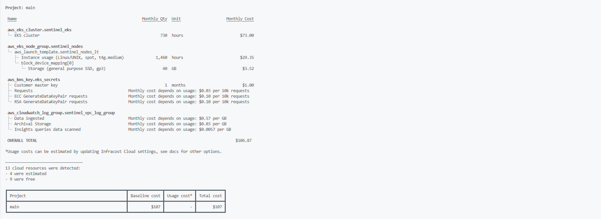

# AWS FinOps, IaC Security & Cost Optimization

*Production-grade Terraform manifests and Infracost analysis demonstrating an 85% infrastructure cost reduction while sustaining 25,300+ RPS at sub-7ms latency.*

## FinOps Impact Summary

| Metric | Baseline (Unoptimized) | Optimized (Current) | Delta |
| :--- | :--- | :--- | :--- |
| **Monthly Cost** | ~$744.00 | **$107.00** | **-85%** |
| **Throughput** | 25,300+ RPS | 25,300+ RPS | 0% (No degradation) |
| **Tail Latency** | < 7ms | < 7ms | 0% (No degradation) |

## The Optimization & Architecture Strategy

The financial bottleneck was eliminated by pivoting from an unoptimized "lift and shift" managed service model to an aggressively tuned, structurally secure Kubernetes architecture.

### 1. Network & Managed Service Purge
* **Legacy Setup (~$744):** Relied on expensive NAT Gateways (~$35/mo), over-provisioned EKS worker nodes (~$194/mo), and managed data services like PostgreSQL (~$134/mo) and ElastiCache (~$119/mo).
* **Action:** Eliminated the NAT Gateway overhead by optimizing traffic routing. Purged managed datastores and migrated workloads directly into the EKS cluster as isolated Helm pods, replacing heavy Redis deployments with the highly efficient **Valkey**.

### 2. Escaping CFS Throttling (The CPU Limit Epiphany)
* **Legacy Setup:** Attempted to use "Guaranteed QoS" by hard-capping CPU limits, which paradoxically led to artificial latency spikes due to Linux Kernel CFS (Completely Fair Scheduler) quota throttling.
* **Action:** Shifted to a **Burstable QoS** model. We strictly define resource `requests` to ensure millimeter-perfect pod scheduling, but **intentionally omit CPU limits**.
* **Impact:** Microservices (Go/Rust) can now burst into idle node CPU cycles when needed. Zero artificial throttling, zero OOMKilled events, and absolute elimination of idle compute waste.

### 3. Graviton ARM64 & Spot Instance Synergy
* **Action:** Capitalized on the ultra-low resource footprint of our memory-safe microservices by transitioning the entire EKS node group to **Graviton ARM64 (`t4g.medium`) Spot Instances**.
* **Impact:** Graviton processors deliver up to 40% better price-performance over x86. Combined with SPOT capacity, we reduced our compute baseline to ~$32/month—a fraction of the original on-demand rates.

### 4. IaC Security via Bridgecrew Checkov
* **Action:** Cost reduction must not come at the expense of security. We integrated **Checkov** into both our local `.pre-commit-config.yaml` and GitHub Actions pipeline. Added KMS keys for secure encryption and enabled CloudWatch Log Groups.
* **Impact:** Every Terraform configuration is continuously scanned for compliance. Exposed S3 buckets, missing VPC Flow Logs, and misconfigured Security Groups are blocked before they ever leave the developer's machine.

---

## Infracost Evidence: Before vs. After

### Baseline Architecture (~$744 / month)
*The original managed-service heavy architecture cost breakdown.*

### Optimized Architecture (~$107 / month)
*The current Graviton-powered, in-cluster optimized cost breakdown.*

* **EKS Control Plane:** $73.00/mo *(Fixed AWS Fee)*
* **Graviton Spot Nodes + EBS:** ~$32.87/mo
* **KMS & CloudWatch Security:** ~$1.00/mo
* **Total:** **~$107.00 / month**
