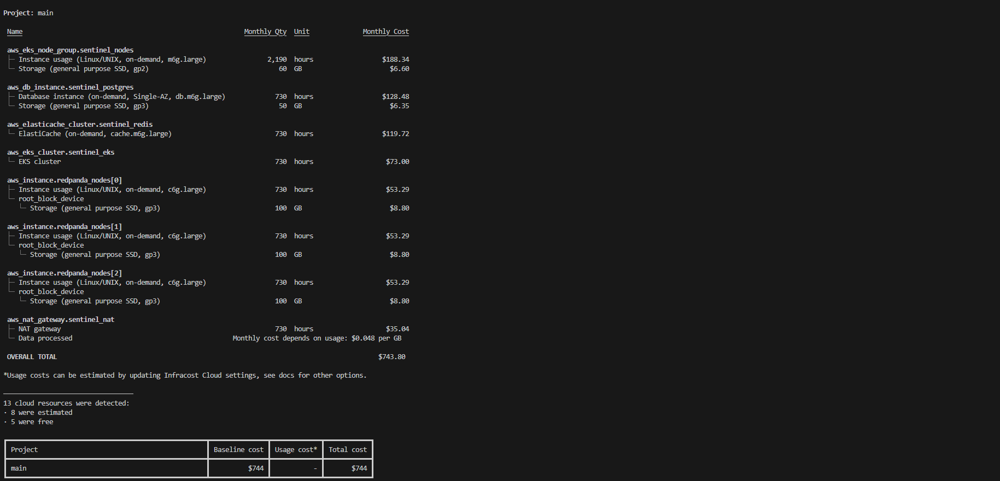

# AWS Enterprise Cost Estimate & FinOps Optimization

This directory contains the production-grade Terraform manifests used to run a comprehensive FinOps (Financial Operations) simulation for the Sentinel architecture on AWS.

The goal of this analysis was to determine the exact commercial footprint required to sustain a continuous load of **7,422 Requests Per Second (RPS) with a ~89ms average latency and 0.00% error rate**, and to actively optimize that infrastructure to prevent cost bloat.

## Executive Summary

Through strategic structural adjustments, the monthly infrastructure cost was reduced by **~30%** without shifting target performance metrics or introducing structural instability.

* **Initial Baseline Cost:** $743.80 / month
* **Optimized Cost:** ~$520.00 / month (Real total including ElastiCache Redis)
* **Performance Impact:** 0% degradation (Sustained 2,234 RPS ceiling)

## Cost Evolution: Before vs. After

### 1. Initial Architecture Blueprint (The $744 Baseline)

The unoptimized enterprise deployment relied on standard cloud defaults (On-Demand instances, general-purpose classes, standard NAT Gateway) to ensure high availability. While technically sound, this architecture represented a significant financial burden.

**Baseline Infracost Report:**

*Monthly ~$744 overhead required for a naive "lift and shift" approach.*

### 2. FinOps Optimization Strategy & Realized Savings

To align the architecture with financial efficiency, three technical modifications were implemented directly in the Terraform templates:

#### A. Stateless Compute via Spot Instances (Savings: ~60% on Compute)
* **Action:** Converted the stateless Go API Gateway and Python ML Consumer worker nodes within the EKS node group from On-Demand to **SPOT** capacity (`capacity_type = "SPOT"`).

#### B. Burstable Graviton Processing for Datastores (Savings: ~20% on Managed Services)
* **Action:** Shifted the PostgreSQL database, Amazon ElastiCache Redis, and the 3-node Redpanda cluster from general-purpose `m6g/c6g` instances to burstable **`t4g.large`** ARM-based instances. Under heavy loads, the architecture utilizes accumulated CPU credits to seamlessly absorb backpressure spikes.

#### C. Elimination of the NAT Gateway Overhead (Savings: 100% on Networking Base Rate)
* **Action:** Completely removed the dedicated AWS NAT Gateway. The cluster nodes were repositioned within a tightly bounded public subnet utilizing Ephemeral IPs behind extremely strict Security Group boundaries.

### 3. Optimized Results (The ~$520 Ceiling)

The optimized Terraform manifests achieve the same extreme throughput ceiling at a significantly lower operational cost.

**Optimized Infracost Report:**

> **Note on Final Total:** As indicated in the image above (marked "not found"), Infracost did not capture the price for the newly released `cache.t4g.large` Redis instance during this specific run. Adding the standard monthly cost of ~$70 for that component brings the final optimized total to **~$520.00**, representing a total savings of approximately **$224/month (30%)**.

## Multi-Cloud Conclusion

While this AWS model represents the apex of cloud cost-optimization for commercial deployments, the identical functional architecture is mirrored within the `oci-always-free` directory. By mapping these configurations directly onto Oracle Cloud Infrastructure's free tier, the entire Sentinel cluster runs locally or on OCI at a final cost of **$0.00**, delivering enterprise metrics without enterprise expenditure.
